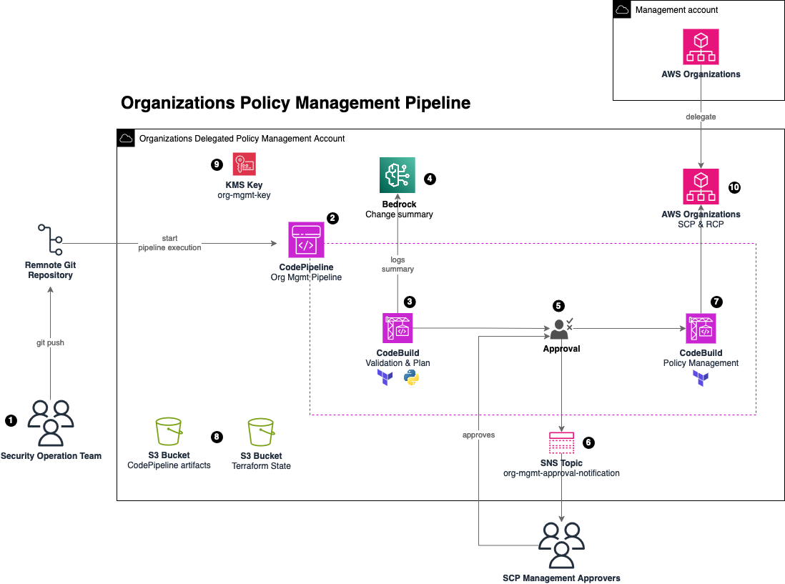

# Organization Policy Management Pipeline
## Visão Geral
Authorization policies in AWS Organizations enable you to centrally configure and manage access for principals and resources in your member accounts. How those policies affect the organizational units (OUs) and accounts that you apply them to depends on the type of authorization policy that you apply. Service Control Policies (SCPs) are principal-centric controls. SCPs create a permissions guardrail, or set limits, on the maximum permissions available to principals in your member accounts. Resource Control Policies (RCPs) are resource-centric controls. RCPs create a permissions guardrail, or set limits, on the maximum permissions available for resources in your member accounts.

This pattern helps you to manage SCP and RCP as code abstracting the burden of having to build and maintain multiple policies with different guardrails using CloudFormation or Terraform. With this pattern, you can achieve the following:
- Create, delete, update SCP/RCPs using a “manifest” JSON file (scp-management.json and rcp-management.json)
- Work with guardrails, not policies. You define your preventive guardrails and its Targets (see below) and the pipeline will do the rest: it will merge and optimize your guardrails in a single policy and apply in the Target as described in the manifest file
- Apply SCP/RCP policies in your targets. A target in the pipeline could be:
    - An AWS account
    - An Organization Unit (OU)-
    - An Environment (a group of OU and/or accounts defined in the environments.json file)
    - A tag: a group of account that shares the same key:value tag
- A manual approval is required in the pipeline. This pattern uses Amazon Bedrock to read an summarize all pipeline logs in an executive summary to send to approvers so they don’t have to dig into the logs to understand and approve proposed changes

To manage SCP and RCP as code, this solution deploys a continuous integration and continuous delivery (CI/CD) pipeline that uses AWS CodeBuild and AWS CodePipeline.

## Prerequisites and limitations
### Prerequisites
- A multi-account environment managed as an organization in AWS Organizations. For more information, see Creating an organization.
- AWS Resource Control Policies feature enabled in AWS Organization. For more information, see Enabling a policy type in the AWS Organizations documentation.
- A repository in your source code host, such as GitHub.
- A member account that is registered as the delegated administrator AWS Organizations – For instructions, see policy below. 
- (Optional) The Amazon Bedrock Claude 3.5 Sonnet model enabled in your the AWS account you will use to deploy the pipeline. For more information, see Add or remove access to Amazon Bedrock foundation models.
```
{
  "Version": "2012-10-17",
  "Statement": [
    {
      "Sid": "DelegationToAudit",
      "Effect": "Allow",
      "Principal": {
        "AWS": "arn:aws:iam::{{SCP_MGMT_ACCOUNT_ID}}:root"
      },
      "Action": [
        "organizations:ListTargetsForPolicy",
        "organizations:CreatePolicy",
        "organizations:DeletePolicy",
        "organizations:AttachPolicy",
        "organizations:DetachPolicy",
        "organizations:DisablePolicyType",
        "organizations:EnablePolicyType",
        "organizations:UpdatePolicy",
        "organizations:DescribeEffectivePolicy",
        "organizations:DescribePolicy",
        "organizations:DescribeResourcePolicy"
      ],
      "Resource": "*"
    }
  ]
}
```


### Limitation
- This pattern cannot be used to manage SCPs/RCPs created outside the pipeline. It will only manage policies created within the pipeline.
- This pattern follows the Quotas and service limits for AWS Organizations
- This pattern cannot be used to manage Management policies (i.e., backup policies, tag policies, chatbot policies, declarative policies).
- This pattern was tested with Terraform version 1.9.8.


## Architecture
### Stack de tecnologia
* AWS CodeBuild
* AWS CodeCommit
* AWS CodePipeline
* Amazon EventBridge
* AWS Organizations
* AWS Key Management Service
* Amazon Bedrock

### Target architecture 


1. A user commits changes to the remote repository, such as GitHub
2. If the user committed a change to the remote repository to the main branch, the pipeline starts.
3. CodePipeline starts the ValidationPlan CodeBuild project. The ValidationPlan CodeBuild project uses a Python script in the remote repository to validate policies and SCP/RCP manifest files. CodeBuild do the following:
* Check if scp-management.json and rcp-management.json manifest files have unique statement IDs (Sid) in its JSON files.
* The ValidationPlan CodeBuild project uses Python scripts (scp-policy-processor/main.py and rcp-policy-processor/main.py) to concatenate guardrails in the guardrails/ folder in a single RCP/SCP policy. It will optimize its size by combining guardrails with same Resource, Action and Condition. CodeBuild uses IAM Access Analyzer validate-policy in the final optimized policy and it will break the pipeline unless all findings are fixed.
* Create a scps.json and rcps.json files with information for Terraform to import and create resources.
* Plan the changes using the command terraform plan
* The ValidationPlan CodeBuild project uses another python script (bedrock-prompt/prompt.py) to create a prompt to Amazon Bedrock (defined in the bedrock-prompt/prompt.txt) so it can create a summary of the Terraform proposed changes
4. Amazon Bedrock will use Claude 3.5 Sonnet model to summarize all Terraform and Python logs so approvers don’t have to dig into the logs to understand the changes.
5. The summary created by Amazon Bedrock will be displayed in the Manual Approval stage. Changes will only be applied after manual approval.
6. Changes are also emailed by SNS Topic
7. CodePipeline starts the Apply CodeBuild project. The Apply CodeBuild Project uses Terraform to apply the changes in AWS Organization.
8. Terraform state file is stored in a S3 Bucket. CodePipeline artifacts and scripts (such as scp-policy-processor/main.py and bedrock-prompt/prompt.py) are stored in another S3 bucket and downloaded during pipeline execution.
9. A KMS key is created to encrypt all resources from this pattern.
10. AWS Organization is delegated from AWS Management Account so the Organization Policy Management Account can manage SCP/RCP policies (see Prerequisites above)

## Tools
* AWS CodeBuild is a fully managed build service that helps you compile source code, run unit tests, and produce artifacts that are ready to deploy. 
* AWS CodePipeline helps you quickly model and configure the different stages of a software release and automate the steps required to release software changes continuously.
* Amazon EventBridge is a serverless event bus service that helps you connect your applications with real-time data from a variety of sources. For example, AWS Lambda functions, HTTP invocation endpoints using API destinations, or event buses in other AWS accounts.
* AWS Organizations is an account management service that helps you consolidate multiple AWS accounts into an organization that you create and centrally manage.
* AWS SDK for Python (Boto3) is a software development kit that helps you integrate your Python application, library, or script with AWS services.
Amazon Simple Storage Service (Amazon S3) is a cloud-based object storage service that helps you store, protect, and retrieve any amount of data.

## Security

See [CONTRIBUTING](CONTRIBUTING.md#security-issue-notifications) for more information.

## License

This library is licensed under the MIT-0 License. See the LICENSE file.